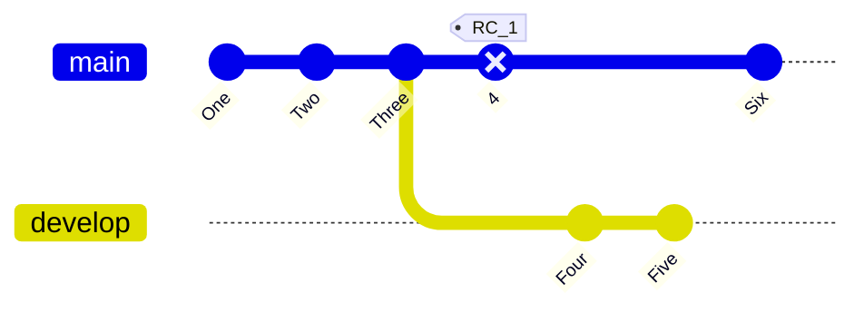

# How to use this nkdocs

## Links

- [GitHub](https://github.com/Z01P24/doc)

## Markdown extensions

### Code blocks

``` py title="bubble_sort.py" linenums="1"
def bubble_sort(items):
    for i in range(len(items)):
        for j in range(len(items) - 1 - i):
            if items[j] > items[j + 1]:
                items[j], items[j + 1] = items[j + 1], items[j]
```

### Icons, Emojis

Search your icons/emojis [here](https://squidfunk.github.io/mkdocs-material/reference/icons-emojis/#search)

> Note: if it's a brand, always use the [Simple Icons](https://simpleicons.org/)

Example: `:simple-html5:`

### table

title | title | title
-|-|-
content | sub | sub
content | sub | sub
content | sub | sub

### Graphs and schematics



## code blocks
