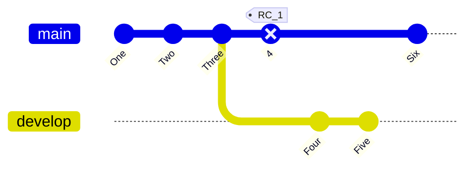

# titre

## sub

```sh


```

## table

title | title | title
-|-|-
content | sub | sub
content | sub | sub
content | sub | sub

### git graph



## code blocks

``` py title="bubble_sort.py" linenums="1"
def bubble_sort(items):
    for i in range(len(items)):
        for j in range(len(items) - 1 - i):
            if items[j] > items[j + 1]:
                items[j], items[j + 1] = items[j + 1], items[j]
```